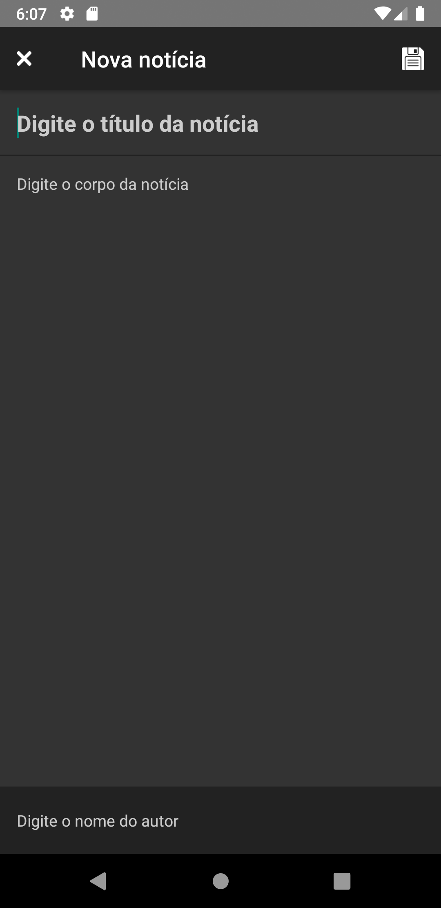

<h2 align='center'> App de Notícias </h2>

- Utilizando Redux e Redux Persist
- React Navigation 5.x

## :fire: Setup
```
$ git clone https://github.com/edufontana/AppNoticias.git
```

- Dentro da pasta do projeto, executar o comando:

```
$ yarn install 

Ou

$ npm install
```
- Dar o build no aplicativo IOS ou Android:

```
$ react-native run-android

$ react-native run-ios (Só funciona no macOS)

```

<p align="center">
  
</p>

